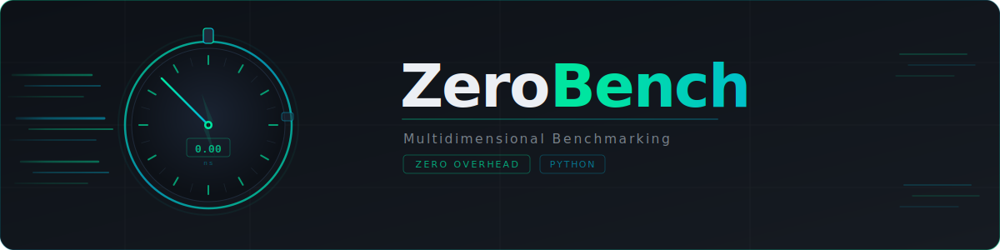

<div align="center">

</div>


# Documentation

[](https://pypi.org/project/zerobench)
[](https://pypi.org/project/zerobench)

```{include} ../../README.md
---
start-after: "<!-- Start common text with source/index.md -->"
end-before: "<!-- End common text with source/index.md -->"
---
```

## Content

```{toctree}
:maxdepth: 2
:caption: User Guide

user-guide/installation
user-guide/getting-started
user-guide/jax-examples
```

```{toctree}
:maxdepth: 2
:caption: API Reference

api/index
```

```{toctree}
:maxdepth: 1
:caption: Developer Guide

developer-guide
```

## Indices and tables

- {ref}`genindex`
- {ref}`modindex`
- {ref}`search`
